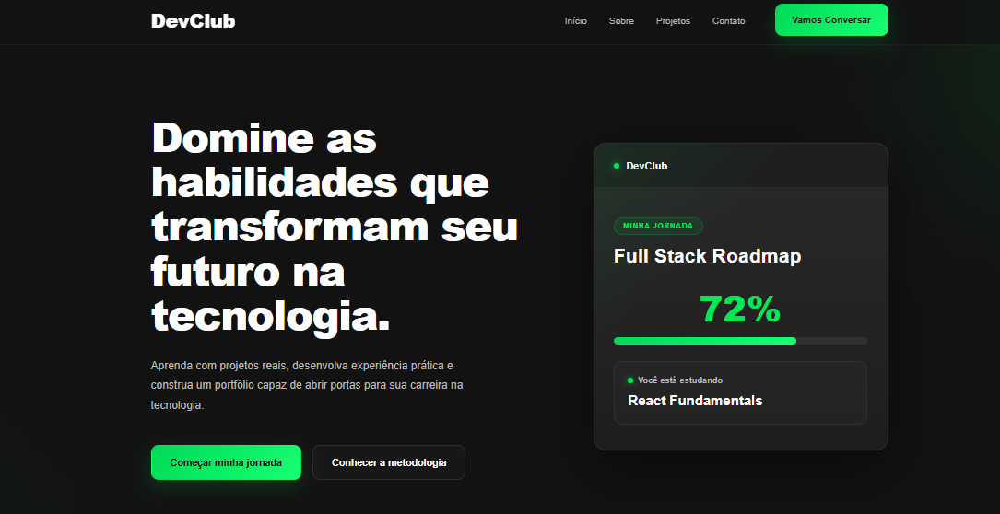
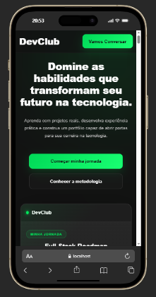

<p align="center">

# 🚀 DevClub Landing

### Landing page moderna inspirada no DevClub, desenvolvida com React + Vite.

[](https://react.dev/)
[](https://vitejs.dev/)
[](https://developer.mozilla.org/pt-BR/docs/Web/JavaScript)
[](https://developer.mozilla.org/pt-BR/docs/Web/CSS)

</p>

---

## 🌐 Demonstração

🔗 **Projeto Online**

devclub-landing-peach.vercel.app

---

## 📸 Preview

### Desktop

<p align="center">

</p>

---

### Mobile


<p align="center">

</p>

---

# 📖 Sobre o projeto

Este projeto consiste em uma landing page moderna desenvolvida com **React** e **Vite**, inspirada na identidade visual do **DevClub**.

O objetivo foi colocar em prática conceitos modernos de desenvolvimento Front-end, criando uma interface premium, totalmente responsiva e organizada através da componentização.

Durante o desenvolvimento foram aplicados princípios de:

- UI Design
- UX Design
- Responsividade
- Componentização
- Organização de código
- Reutilização de componentes
- Animações suaves
- Boas práticas em React

O projeto foi desenvolvido simulando um cenário profissional, priorizando organização, escalabilidade e experiência do usuário.

---

# ✨ Funcionalidades

- ✅ Landing Page moderna
- ✅ Interface responsiva
- ✅ Navegação suave
- ✅ Componentes reutilizáveis
- ✅ Estrutura organizada
- ✅ Animações em CSS
- ✅ Layout Premium
- ✅ Código limpo
- ✅ Organização por componentes
- ✅ Design inspirado em plataformas SaaS

---

# 🛠 Tecnologias

- React
- Vite
- JavaScript (ES6+)
- HTML5
- CSS3
- Lucide React

---

# 📂 Estrutura do Projeto

```text
src
│
├── assets
│
├── components
│   ├── layout
│   └── sections
│
├── pages
│
├── styles
│
├── App.jsx
└── main.jsx
```

---

# 📱 Responsividade

O projeto foi desenvolvido para proporcionar uma boa experiência em diferentes tamanhos de tela.

✔ Smartphones

✔ Tablets

✔ Notebooks

✔ Monitores Desktop

---

# 🚀 Como executar o projeto

Clone o repositório

```bash
git clone https://github.com/maycon-douglasd/devclub-landing.git
```

Entre na pasta

```bash
cd devclub-landing
```

Instale as dependências

```bash
npm install
```

Execute o projeto

```bash
npm run dev
```

---

# 🎯 Objetivo

Este projeto foi desenvolvido com foco no aperfeiçoamento das habilidades em desenvolvimento Front-end.

Os principais objetivos foram:

- Construção de interfaces modernas
- Componentização com React
- Organização de projetos
- Desenvolvimento responsivo
- Aplicação de boas práticas
- Evolução em UI/UX
- Estruturação profissional de código

---

# 👨‍💻 Autor

### Maycon Douglas

Desenvolvedor Front-end em constante evolução, apaixonado por tecnologia e criação de interfaces modernas.

---

# ⭐ Gostou do projeto?

Se este projeto foi interessante para você, deixe uma ⭐ no repositório.

Isso ajuda bastante e incentiva a criação de novos projetos.

---
